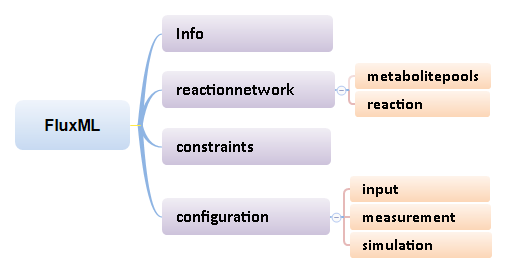
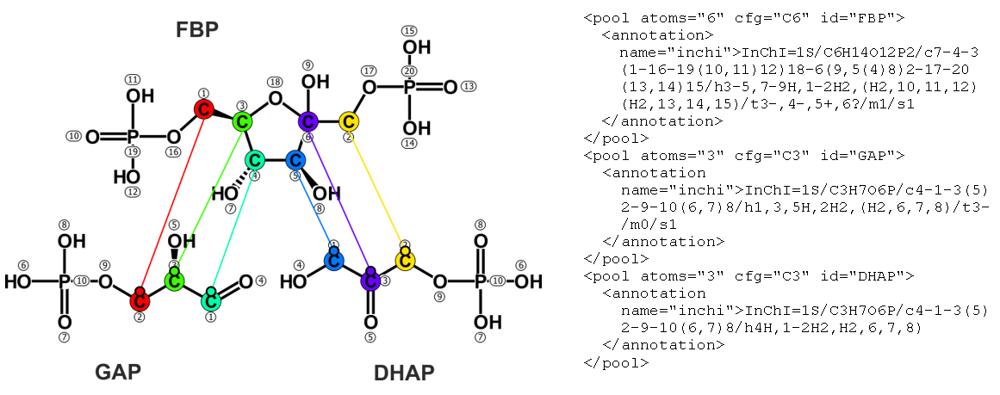
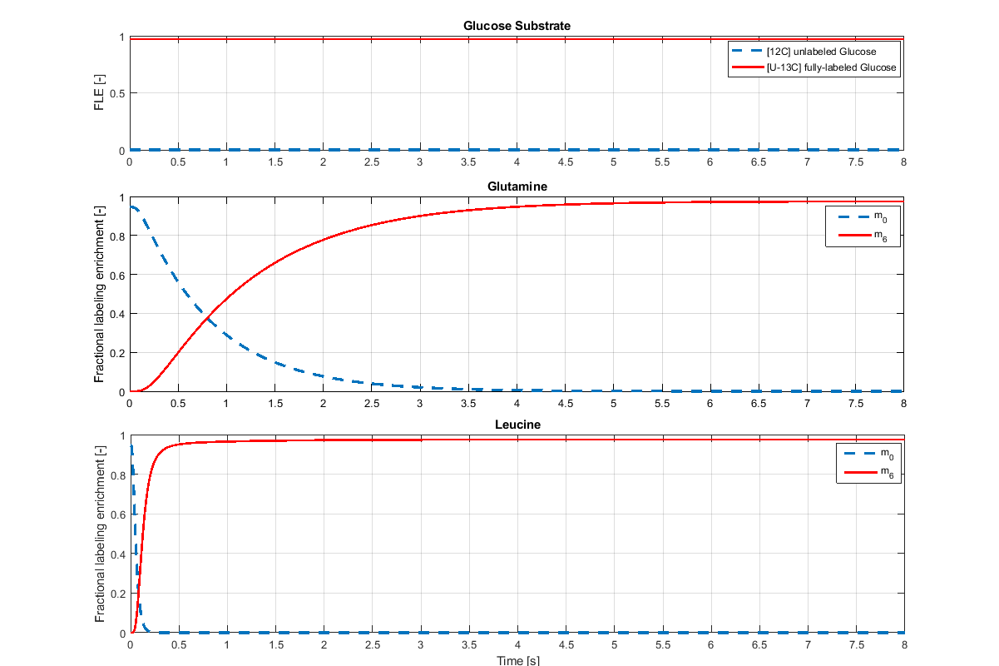
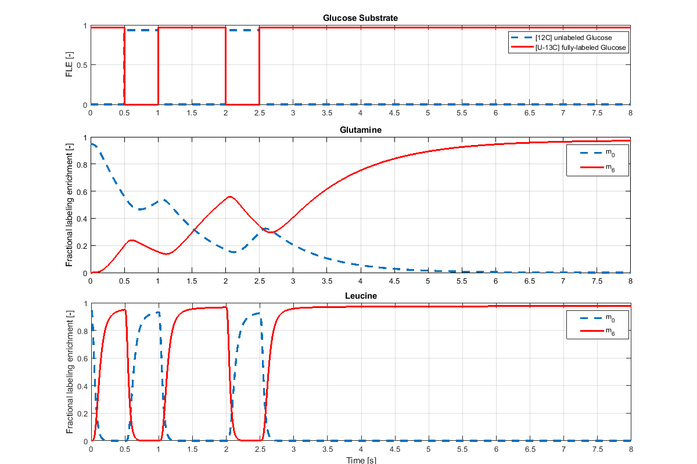
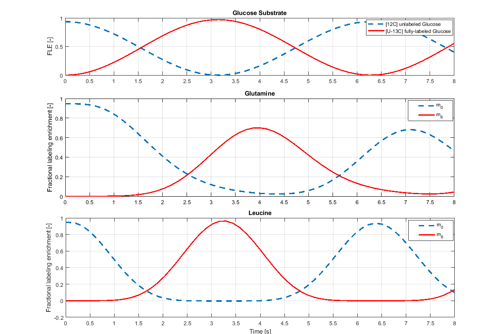
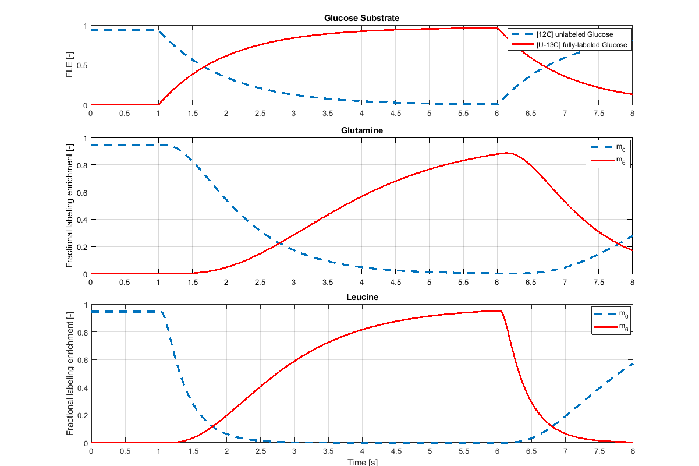
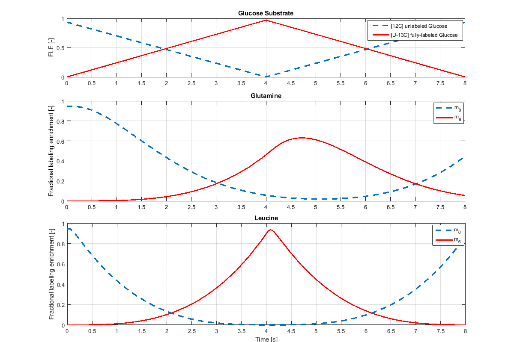
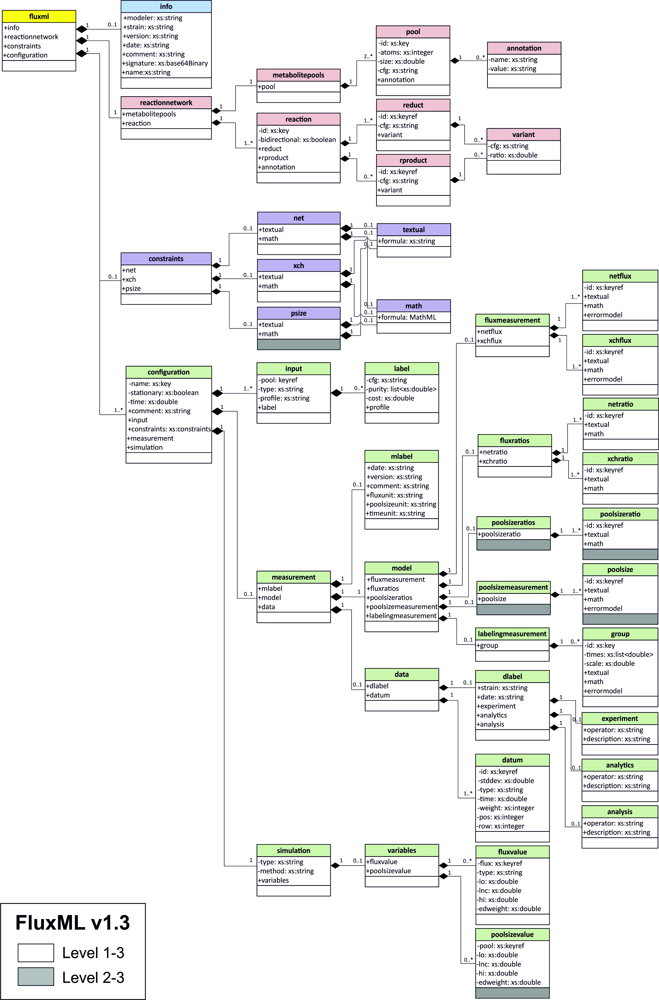

<p align="center"> </p>

## Introduction
<p align="justify">FluxML is a universal modeling language for metabolic flux analysis designed with the aim of providing a standard document format for creating, validating and reliable exchanging of arbitrary metabolic models across different simulation tools. It's hierarchically structured based on widely used XML (eX-tensible Markup Language) and specified all essential information required to enable performing both isotopically stationary and non-stationary 13C metabolic Fux analysis including the structure of the metabolic network, atom transitions, experimental data, model constraints and parameters. <br/>
FluxML is organized in three major releases, termed Levels. Level 1 is dedicated to isotopically stationary 13C MFA while Level 2 covers isotopically non-stationary 13C MFA in addition. With Level 3 the general case of multiple, isotopically stationary and non-stationary isotopic tracer experiments are supported. For all released FluxML Levels, a formal syntax description defined in a W3C XML Schema Document (https://13cflux.net/fluxml), an associated [UML diagram](images/fluxml_diagram.png) and an open-source  C/C++ library, named <i>libFluxML</i>, for parsing, serializing and manipulating FluxML documents which supports all releases of FluxML up through Level 3 are provided. In the following sections the FluxML elements are briefly addressed.</p>

FluxML is published in Frontiers in Microbiology ([doi: 10.3389/fmicb.2019.01022](https://www.frontiersin.org/articles/10.3389/fmicb.2019.01022/abstract)). If you use this work, please cite accordingly.


## Table of Contents
* [Dictionary of XML Terms](#dictionary-of-xml-terms)
* [The Basic Structure of FluxML Format](#the-basic-structure-of-fluxml-format)
* [Network Structure and Atom Mappings](#network-structure-and-atom-mappings)  
* [Global Stoichiometric Constraints](#global-stoichiometric-constraints)
* [Different Configurations of Reaction Network](#different-configurations-of-reaction-network)  
  - [Input Mixture Specification](#input-mixture-specification)
  - [Local Stoichiometric Constraints](#local-stoichiometric-constraints)
  - [The Simulation Section](#the-simulation-section)
* [Measurement Specification](#measurement-specification)    
  - [Isotopic Labeling Measurements](#isotopic-labeling-measurements)
  - [Flux Measurement](#flux-measurement)
  - [Pool Size Measurement](#pool-size-measurement)
  - [Measurement Data](#measurement-data)
  - [Measurement Short Notations](#measurement-short-notations)
* [Simulation Variables](#simulation-variables) 
* [Example models expressed in XML using FluxML](#example-models-expressed-in-xml-using-fluxml)  
  - [A Simple Toy Model](#a-simple-toy-model)
  - [A Typical Escherichia-coli Model](#a-typical-escherichia-coli-model)
* [UML diagram](#uml-diagram)    
  
  
## libFluxML C++ API
<p align="justify"> LibFluxML is an open-source library for reading and manipulating FluxML documents. The current version of LibFluxML supports all releases of FluxML up through Level 3. For more information about FluxML, please see [FluxML Language Specification](#the-basic-layout-of-fluxml-format) above. </p>

* [Download & Installation](#download-&-installation)
* [Getting Started](#getting-started)
* [Licensing](#licensing)
* [Code Example](#code-example)
* [The Online FluxML Validator](#the-online-fluxml-validator)

<hr>
<a rel="license" href="http://creativecommons.org/licenses/by-sa/4.0/"></a> This work is licensed under the <a rel="license" href="http://creativecommons.org/licenses/by-sa/4.0/">Creative Commons Attribution Share Alike 4.0</a>.
<hr>

## Dictionary of XML Terms
<p align="justify"> In order to fully understand the organization of any XML-based data format, it is necessary to understand the following basic terms and how they apply to the data structure. Note that this dictionary is in no way complete; it is purely intended to provide a frame of reference for the sections that follow. For those interested in learning the complete language and terminology of XML, please refer to the XML resources section of the W3C web site (http://www.w3.org/XML/).</p>

### Document
<p align="justify"> The standard term for a body of data that is formatted and described using XML is generally referred to as a "document." Although the ASCII characters that make up an XML data stream can be stored to nonvolatile storage in many hardware and operating systems, the concept of a "file" does not really apply to XML data. XML representations of data can also be generated from database queries, software applications, or even hardware and streamed between computers without ever existing as a "file" in any one particular operating system. However, for practical purposes in the case of storing analytical instrument data to a long term archive (files in non-volatile storage), the term "file" and "document" are basically equivalent and are used as interchangeable terms in the following descriptions.</p>

### Element
<p align="justify"> An "element" is a unique tag used to represent a specific piece of information in XML. An element can consist of data or be a collection of other elements. Elements are the fundamental building blocks used to identify data and define relational hierarchies of information in an XML document.</p>

### Attribute
<p align="justify">An "attribute" is an item of information attached to an element that is relevant to the data contained within the element itself. In some cases, information stored in an attribute could also be represented as an additional element within the parent element's hierarchy. However, attributes of a given type can be applied to one or more elements within an XML hierarchy, while elements generally follow a specific hierarchy (although this is not a requirement)</p>

### Namespace
<p align="justify"> XML namespaces are used for providing uniquely named elements and attributes in an XML document. They are defined in a W3C  <a href="http://www.w3.org/XML/">recommendation</a>. An XML instance may contain element or attribute names from more than one XML vocabulary. If each vocabulary is given a namespace, the ambiguity between identically named elements or attributes can be resolved.
</p>

## The Basic Structure of FluxML Format
<p align="justify"> Being a XML format, the layout of FluxML is hierarchic. Figure 1 shows the hierarchical structure of the FluxML document. The top-level element fluxml contains the optional element info which provides basic information about the model and the element reactionnetwork containing the metabolites and reactions which, together with the constraints element defines the isotope network structure. A very important core concept in FluxML is that of configurations, encoding the concept that one model structure can be evaluated within different experimental settings. In this way, model instances that, for instance, distinguish themselves in the selection of the substrate (input pool) or the tracer mixture, flux parametrization and/or measurement configuration can be stored in different sections within the same file. Another key concept of FluxML is the separation of the experimental data declaration and their specification as represented by the measurement sub-elements model and data, respectively.
</p>
<p align="center"> <br><b>Figure 1:</b> The main elements of the FluxML document</p>

<p align="justify"> Like any other well-formed XML document, the FluxML document can optionally begin with an XML preamble. This is mostly used to provide XML version information and to declare the character encoding of the document. Especially for FluxML documents the XML version 1.0 and the UTF-8 character encoding should be used, while the attribute standalone is optional and signals FluxML parsers and validators that the document depends on an external document type definition (DTD). The XML preamble is followed by exactly one single root element fluxml, which indicates parsing applications the starting point for reading the encapsulated data. The root element can have a number of optional attributes. This usually includes an "xmlns" attribute indicating the XML namespace denoted by URI "http://13cflux.net/fluxml" which tells parsers the location of XML schema grammar that was used to write the document. The following XML fragment shows the basic structure representation of a FluxML document:</p>

```xml
<fluxml xmlns="http://www.13cflux.net/fluxml"> 
   <info> ... </info> [0..1]
   <reactionnetwork> ... </reactionnetwork> [1]
   <constraints> ... </constraints> [0..1]
   <configuration> ... </configuration> [1..*]
</fluxml>
```

<p align="justify">The first element below the root element fluxml is the optional element <b>info</b> which provides basic information about described model and contains a number of optional subelements:</p>

<!--
XML Schema Representation:
```xml
<xsd:element name="info">
   <xsd:complexType>
      <xsd:sequence>
         <xsd:element ref="name" minOccurs="0"/>
         <xsd:element ref="version" minOccurs="0"/>
         <xsd:element ref="date" minOccurs="0"/>
         <xsd:element ref="comment" minOccurs="0"/>
      </xsd:sequence>
   </xsd:complexType>
</xsd:element>
```
XML Instance Representation:
-->
```xml
<info> 
  <modeler> xsd:string </modeler> [0..1]
  <strain> xsd:string </strain> [0..1]
  <version> xsd:string </version> [0..1]
  <date> \d{4}-\d{2}-\d{2} \d{2}:\d{2}:\d{2} </date> [0..1]
  <comment> xsd:string </comment> [0..1]
  <signature> xsd:string </signature> [0..1]
</info>
```
<p align="justify">The modeler and strain indicate the name of the modeler and used strain, respectively. The version of the FluxML Specification Language is given by the sub-element version. This is used to notify parsing program that the document they are reading is properly formatted against the schema for that specified version. The timestamp element date allows to specify the date of model creation/modification . If the date is stated, it has to follow the standard format "YYYY-MM-DD HH:MM:SS". The comment field can be used to store additional remark or model specific information. Finally, the signature field which represents an important tag and is intended for automatic signing of FluxML documents. The following example shows a FluxML instance representation of the element info:</p>

```xml
<info >
   <modeler>Mr. JuFLUX</modeler>
   <strain>Escherichia coli: Ecoli_K12_Crown</strain>
   <version>1.0</version>
   <date>2016-12-31 23:59:59</date>
   <comment>name: Ecoli_K12_Crown_CN.fml; original source: https://doi.org/10.1016/j.ymben.2015.01.001; creators: M Cerff, S Azzouzi, K Noeh, info@13cflux.net; changelog/documentation: https://fz-juelich.sciebo.de/index.php/s/8qmdIFPngF4kPkv; distributed under CC BY-SA 4.0 license conditions </comment>
   <signature>dlk]587JHVFDjng54gerl WEWE4tr878re7t</signature>
</info >
```
<!--In the following, a detailed description of each FluxML element will be followed in the next section.-->

### Network Structure and Atom Mappings
<p align="justify"> The next mandatory element is the <b>reactionnetwork</b> containing all information relating to the isotope network structure. This includes a list of metabolite pools which can be declared under the element <b>metabolitepools</b> and a set of reactions that can be specified by using the element <b>reaction</b>. The latter one can appear as many times as necessary to describe all reactions in the network; however, the metabolitepools can only appear once. The following fragment shows the XML instance representation of the element reactionnetwork:</p>

```xml
<reactionnetwork> 
  <metabolitepools> ... </metabolitepools> [1]
  <reaction> ... </reaction> [1..*]
</reactionnetwork>
```

<p align="justify"> The list of metabolites consists of two or more pool elements. A <b>pool</b> represents a metabolite pool and is characterized by a number of attributes:</p>

```xml
<metabolitepools> 
  <pool id="xsd:ID [1]"  atoms="AtomType [0..1]" cfg="AtomCfgType [0..1]">
      <annotation name="xs:string"> xs:string </annotation> [0..*]
   </pool> [2..*]
</metabolitepools>
``` 

<p align="justify"> The "id" attribute is always required and describe a unique identifier that has to follow the same conventions used for identifiers in programming languages. The "atoms" attribute indicates the total number of atoms available as labeling positions, while the "cfg" attribute provides additional information about the number of atoms of each chemical element used by the Isotopic Labeling Experiment (ILE). For example, the following configuration **"C1H2O3N4"** de- notes that one carbon, two hydrogen, three oxygen and four nitrogen are used by ILE. Please note that, If the "atoms" attribute is omitted the metabolite is assumed to have zero labeling positions. This allows to model purely stoichiometric networks. Analog to the "cfg" attribute, which can also be omitted, in case that, only one chemical element is used.</p>
<p align="justify">  The pool element may include additional <b>annotations</b>, which can be used to store additional textual information. The annotations are not evaluated by the FluxML parser and their content is purely informational. The following example illustrates the specification of tree metabolite pools: Fructose-bisphosphate (FBP), Glyceraldehyde 3-phosphate (GAP) and Dihydroxyacetone phosphate (DHAP) modeled by a multiple isotope labeling experiment:</p>
   
```xml
<metabolitepools> 
  <pool id="FBP" atoms="6" cfg="C6N0">
      <annotation name="inchi">InChI=1S/C6H14O12P2/c7-4-3(1-16-19(10,11)12)18-6(9,5(4)8)2-17-20(13,14)15/h3-5,7-9H,1-2H2,(H2,10,11,12)(H2,13,14,15)/t3-,4-,5+,6?/m1/s1</annotation>
    </pool>
    <pool id="GAP" atoms="3" cfg="C3N0">
	<annotation name="inchi">InChI=1S/C3H7O6P/c4-1-3(5)2-9-10(6,7)8/h1,3,5H,2H2,(H2,6,7,8)/t3-/m0/s1</annotation>
    </pool>
    <pool id="DHAP" atoms="3" cfg="C3N0">
	<annotation name="inchi">InChI=1S/C3H7O6P/c4-1-3(5)2-9-10(6,7)8/h4H,1-2H2,(H2,6,7,8)</annotation>
     </pool>
</metabolitepools>    
```

<p align="justify"> As mentioned before, the reaction element can be used to specify a metabolic reaction. A reaction often describes the transformation of a set of educts (e.g. starting material) into a set of products and is specified below:

```xml
<reaction  id="xsd:ID [1..*]"  bidirectional="xsd:boolean [0..1]"> 
  <annotation> ... </annotation> [0..*]
  <reduct> ... </reduct> [1..*]
  <rproduct> ... </rproduct> [0..*]
</reaction>
```

<p align="justify"> Each <b>reaction</b> element may contain an optional list of annotations and a nonempty list of reactants. Reactants on the left side of the reaction are referenced by the element <b>reduct</b>, while reactants appearing on the right side are referenced by the element <b>rproduct</b>. In case a reaction does not specify any products it is considered to be an efflux from the network (sink). The name of the reaction is given by a unique "id" attribute. The Boolean attribute "bidirectional" allows to introduce simple directionality constraints: setting "bidirectional" to "false" restricts the reaction's exchange flux to zero and the net flux to a non-negative value. For a <i>scrambling reaction</i> multiple variants of the same reaction may exist. In this case the "id" attribute has to specify multiple identifiers for the different variants of the reaction. See below for more information. 

```xml
<{reduct,rproduct} id="xsd:IDREF [1]" cfg="CfgType [0..1]">
  <variant cfg="CfgType [1]" ratio="xsd:double [1]"/>
  ...
</{reduct,rproduct}>
```

<p align="justify"> The specification of an educt or a product references the unique "id" of a pool. In case the referenced metabolite includes a non-zero number of labeling positions the "cfg" attribute has to specify a letter string describing the labeling positions of the educts and product side in a "topological order". Whereby it should be noted that each atom in an educt appears again in a specific position of a reaction product, in other words, the bijection between educts and products atoms must be observed. Furthermore, if the atom transitions of metabolic network are specified by utilizing of the simple letter strings, it is completely up to the modeler to chose a unique number for all labeling positions. An alternate notation with improved readability which allows an unlimited number of labeling positions will be presented below.

Support for scrambling reactions. A list of optional "variant" elements can be used to specify variants of the reaction differing in their atom transitions. Each "variant" element has to specify a "cfg" attribute. In case any "variant" elements are present the "reduct" or "rproduct" elements must not specify an own "cfg" attribute. The optional "ratio" attributes of the "variant" elements allow to specify the likelihoods of the individual reaction variants. In case no "ratio" attributes are specified all variants of the reaction will have the same likelihood. Internally, the likelihoods are implemented using automatically generated stoichiometric equality constraints. The following example demonstrates the use of case-sensitive letters to specify atom transitions, as exemplified by the Fructose-bisphosphate aldolase reaction in glycolysis:

```xml
<reaction bidirectional="true"  id="emp4">
  <reduct cfg="abcdef" id="FBP"/>
  <rproduct cfg="cba" id="GAP"/>
  <rproduct cfg="def" id="DHAP"/>
</reaction>
```

<p align="justify">  As veritable alternative for describing the atom transitions (or atom-atom mapping) between educts and products is the <a href="http://www.inchi-trust.org/">International Chemical Identifier (InChI)</a>, which gives a computer-generated unique character string for molecular structures. Figure 2 shows the INCHI atom numbering scheme as provided by the InChI software (http://www.inchi-trust.org/) as well as the carbon atom transitions for the aldolase reaction. The standard InChI string is widely accepted in the chemical community as the currently best approach for metabolite identification, facilitating database/web-search and information exchange. For more information please visit http://www.inchi-trust.org/.
</p>

<p align="center"> <br><b>Figure 2:</b> Visual carbon atom transitions of the Fructose-bisphosphate aldolase reaction</p>

<p align="justify">Equivalent to the code listing above, the INCHI-based enumeration provides the following encoding of the emp4 reaction:</p>

```xml
<reaction bidirectional="true" id="emp4">
  <reduct cfg="C#1@1 C#2@1 C#3@1 C#4@1 C#5@1 C#6@1" id="FBP"/>
  <rproduct cfg="C#4@1 C#1@1 C#3@1" id="GAP"/>
  <rproduct cfg="C#5@1 C#2@1 C#6@1" id="DHAP"/>
</reaction>
```
Here, each labeling position has to be specified using the following scheme:

	[chem. element]#[position index]@[educt metabolite index]

<p align="justify"> Finally, a multi-element transition is exemplified with the glutamate dehydrogenase in Escherichia coli (gdhA, EC 1.4.1.4) converting a-ketoglutarate (AKG) and ammonia (NH3) to produce L-glutamate (Glu):</p>

```xml
<reaction bidirectional="false" id="gdhA">
  <!— set of reducts -->
  <reduct id="AKG" cfg="C#1@1 C#2@1 C#3@1 C#4@1 C#5@1"/>
  <reduct id="NH3" cfg="N#1@2"/>
  <!— reduct-cofactors -->
  <reduct id="NADPH"/>
  <reduct id="H"/>
  <!— set of rproducts -->
  <rproduct id="Glu" cfg="C#1@1 C#2@1 C#3@1 C#4@1 C#5@1 N#1@2"/>
  <!— rproduct-cofactors -->
  <rproduct id="H2O"/>
  <rproduct id="NADP"/>
</reaction>
```
<p align="justify"> where the cofactors (i.e., metabolites that do not carry labeled material) NADPH, H, H2O, and NADP are explicitly specified as reaction partners, a feature that helps to keep FluxML and SBML reaction network representations consistent.
</p>

### Global Stoichiometric Constraints
<p align="justify">  After the reactionnetwork element follows an optional element <b>constraints</b> containing a list of stoichiometric constraints on the fluxes (reaction bounds) – in the case of INST also on the pool sizes - that can be specified on top of the stoichiometric mass balances which impose additional limitations on the space of possible parameter distributions of the network. Please be aware that, the here specified constraints are assumed to be valid for all possible [configurations](#different-configurations-of-reaction-network) of the network (see below).</p>

There are mainly three types of constraint to be distinguished:

```xml
<constraints> 
  <net> ... </net> [0..1]
  <xch> ... </xch> [0..1]
  <psize> ... </psize> [0..1]
</constraints>
```
<p align="justify"> Elements <b>net</b> and <b>xch</b> list constraints consisting of linear equalities and inequalities on the values of net and exchange fluxes, while the element <b>psize</b> contains constraints applied to metabolite concentrations. Constraints may be associated with a name and are specified either by using the human-readable textual notation or by defining equations in machine-readable Content-MathML notation, which is also supported by SBML (see http://www.w3.org/Math/ for more information).

```xml
<{net,xch,psize}> 
  Start Choice [1]
    <textual> xsd:string </textual> [1]    
    <mml:math> MathML-content </mml:math> [1]
  End Choice
</{net,xch}>
```
<p align="justify">Element textual may include a list of textual constraint equalities and inequalities on the flux values. Multiple (in)equalities have to be separated by semicolons. If a constraint follows a textual description and a colon, the constraint is associated with that description. For inequality constraint specification in a XML document, please beware that, you have to encode "<=" and ">=" as "&lt;"= and "&gt;=". The following example demonstrates the specification of list of constraints:</p>

```xml
<constraints>
  <!-- BM-coeffs [mumol/gCDW], fluxes [mumol/gCDW/s] -->
  <net>    
    <textual> 
      Glc_upt=2.38;
      TCA7_v26_1= TCA7_v26_2;
      0=488*mu2_v70-Ala_bm 
    </textual>
  </net>  
  <xch>
    <math xmlns=http://www.w3.org/1998/Math/MathML>
      <apply>
	<eq/><ci>TCA7_v26_1<ci/><ci>TCA7_v26_2</ci>
      </apply>
  </xch>  
  <!-- Poolsizes [mumol/gCDW] -->
  <psize>    
    <textual>
      Ala&gt;=0.2327;
      Ala&lt;=1.49286;
    </textual>
  </psize>
</constraints>
```
## Different Configurations of Reaction Network
<p align="justify"> Configurations are one of the most important and powerful new paradigms of FluxML, as compared to other modeling languages such as SBML. Iterative 13C-MFA modeling and simulation procedures are shaped by minor modifications of the model formulation which, at the end, typically give raise of forests of models from which only few finally emerge as “release candidates”. Experiences show the majority of differences between alternate models is found in the realization of constraints, parameter sets or values, as well as the composition of the data sets, while the model structure largely remains the untouched. In other scenarios, the same model is used to evaluate data sets from independent ILEs, or from the same ILE with isotopically transient and stationary data sets. FluxML configurations are created with these cases in mind. Within the configurations element input, constraints, measurement, and simulation settings that are specific to one lab or simulation experiment can be bundled. </p>

```xml
<configuration name="xsd:ID [1]" stationary="xsd:string [1]" stoptime="xsd:double [1]"> 
  <comment> ... </comment> [0..1]
  <input> ... </input> [1..*]
  <constraints> ... </constraints> [0..1]
  <measurement> ... </measurement> [0..1]
  <simulation> ... </simulation> [0..1]
</configuration>
```
<p align="justify"> Each single configuration has to specify a unique name through the "name" attribute, the Boolean attribute "stationary" is used to distinguish isotopic stationary (”true”) from isotopic non-stationary measurements ("false"). This should also notify a simulation program which ILE simulation should be performed, a simulation stop time in case of transient simulation and may include a textual comment, which can be used to provide useful information to a human reader. At least one instance of a configuration should be declared in FluxML document, and it must be named as "default". The following example presents a configuration element in FluxML representation.</p>

```xml
<configuration name="default">
  <comment>some comment about default-configuration </comment>
  <input pool="input_pool_0" type="isotopomer"> ... </input>
  <constraints> ... </constraints>
  <measurement> ... </measurement>
  <simulation method="auto" type="auto">
    <variables>
      <!−− a setting of the free fluxes and poolsizes −−>
      <fluxvalue flux="flux_0" type="net">2.3</fluxvalue>
      <fluxvalue flux="flux_2" type="xch">70.1</fluxvalue>
      <poolsizevalue pool="pool_49">0.36725</poolsizevalue>
       ...
    </variables>
  </simulation>
</configuration>
<configuration name="config_0"> ... </configuration>
```
<p align="justify"> FluxML allows having an arbitrary number of such configurations within one file, all sharing the same syntax definition. Combined with the network, each single configuration then constitutes a complete <sup>13</sup>C MFA model. This releases modeler from the necessity to duplicate whole files beyond necessity and makes model management much more transparent and far less error-prone. The configuration elements are briefly addressed in the following sections.</p>

### Input Mixture Specification
<p align="justify"> In FluxML a substrate source with a known labeling composition is specified in the <b>input</b> element by supplying the known fractions of all isotopomers present in the substrate pool(s). Here, it must be taken into account that both, naturally “unlabeled” and commercially available specifically labeled substrates are never 100% pure. For instance, the natural abundance of <sup>12</sup>C and <sup>13</sup>C isotopes are 0.9893 and 0.010, respectively. This leads to a stochastic variation in the isotopomer composition which cannot be neglected. Following the FluxML specification of the input element is shown:</p>

```xml
<input  id="xsd:ID [0..1]" pool="xsd:IDREF [1]" type="xsd:string [0..1]" profile="xsd:string [0..1]"> 
  <label> ... </label> [0..*]
</input>
```
<p align="justify"> By using the attribute "pool", the corresponding "input" element references the unique name of a metabolite pool (which, of course, is required to be a substrate pool). Attribute "type" gives the type of the specification, which may be either "isotopomer" (the default), "cumomer" or "emu" (unusual). While the substrate labeling is required to be constant for classical 13C-MFA, for transient ILEs this is no longer strictly required or even technically possible. In FluxML, versatile labeling profiles can be readily specified through "profile" attribute (see examples below). The input element may contain one or several label elements. If the "input" element does not contain any "label" elements the isotopomer distribution is initialized according to the natural abundance of isotopes (e.g. 12C (98.945%) and 13C (1.055%)).</p>

```xml
<label cfg="xsd:string matching pattern [01xX]+ [1]" purity="xsd:double [0..1] cost="xsd:double [0..1]"> xsd:string</label>
```
<p align="justify"> The element <b>label</b> can be used to specify the fractional abundance of a certain isotopomer (or cumomer|emu) fraction in a labeling source. Attribute "cfg" defines the labeling composition of a certain isotopomer based on a string of "1"'s (labeled positions) and "0"s (unlabeled positions; "X" for cumomer fractions), while the optional attribute "purity" is used to specify the positional isotopic purity of labeled carbon atom positions. All unlabeled atom positions are assumed to be naturally labeled depending on the applied isotpe tracer by ILE. The value of "purity" is assumed to be a fractional value between 0 (0% purity) and 1 (100% purity). Attribute "purity" has no default value - if it is omitted no automatic isotope correction is performed and the substrate specifcation is used as provided. Attribute "cost" can be used to specify the price (e.g. EUR/g) of used labeled isotope by ILE. The following example shows a typical glucose mixture specification of 77% [1-13C]-, 20.5% [U-13C]-, 2.5% [12C]-glucose, including labeling costs (EUR/g):</p>

```xml
<input pool="Gluc_ext" type="isotopomer">
  <label cfg="000000" purity="0.989" cost="0.04" >0.025</label>
    <!-- 1-13C glucose in InChI numbering -->
  <label cfg="000001" purity="0.996" cost="93.0" >0.77</label>
  <label cfg="111111" purity="0.995" cost="188.0" >0.205</label>
</input>
```
The extension of the multiple-element input substrate specification is rather straightforward:

```xml
<input pool="NH3_ext" type="isotopomer">
  <label cfg="1" purity="0.98">1.0</label>
</input>
<input pool="Gln_ext" type="isotopomer">
  <label cfg="1111100" purity="0.98 0.989">0.4</label>
  <label cfg="1111111" purity="0.98 0.989">0.6</label>
</input>
```
here, the FluxML input specification of Glutamine metabolite.

```xml
<pool atoms="7" cfg="C5N2" id="Gln">
  <annotation name="inchi">InChI=1S/C5H10N2O3/c6-3(5(9)10)1-2-4(7)8/h3H,1-2,6H2,(H2,7,8)(H,9,10)/t3-/m0/s1</annotation>
</pool>
```
<p align="justify"> For designing an ILE, several different substrate sources are mixed in given proportions to form the input mixture of the experiments, such as the mixture given before. Arbitrary mixtures of labeled substrates are modeled in FluxML by specifying one separate uptake flux for each tracer pool in the metabolic network. The fact that all these uptake fluxes sum up to an usually directly measureable uptake rate for the corresponding substrate is then specified in the constraint section of a FluxML document, for example:</p>

```xml
<!-- tracer specification -->
<input pool="Gluc_ext_C0" type="isotopomer">
     <label cfg="000000" purity="0.989" cost="0.04">1</label>
</input>
<input pool="Gluc_ext_C1" type="isotopomer">
     <label cfg="000001" purity="0.996" cost="93.0">1</label>
</input>
<input pool="Gluc_ext_C6" type="isotopomer">
     <label cfg="111111" purity="0.995" cost="188.0">1</label>
</input>

<constraints>
  <net>
    <textual> 
       Glc_upt=Glc_upt_C0+Glc_upt_C1+Glc_upt_C6;
    </textual>
  </net>
</constraints>

```
<p align="justify">Where Glc_upt is the total uptake rate and Glc_upt_C0, Glc_upt_C1, Glc_upt_C6 are the mixing rates of naturally [12C]-, [1-13C]-, and fully [U-13C]-labeled glucoses, respectively.</p>

<p align="justify">As mentioned above, FluxML supports the specification of highly customizable labeling profiles for substrate mixture. Various labeling profiles by switching between fully and naturally labeled glucose are presented in the following succinct way:</p>

<b>- Constant substrate profile:</b>

```xml
<input pool="Gluc_ext" type="isotopomer">
  <label cfg="111111" purity="0.995">1</label>
  <label cfg="000000" purity="0.989">0</label>
</input>
```
Here, the simulation results provided by feeding pulse-width modulated input substrate profile:
<p align="center"> <br><b>Figure 3:</b> Simulated mass isotopomer with constant  input substrate profile</p>
<b>- Pulse-width modulated substrate profile:</b>

```xml
<input pool="Gluc_ext" type="isotopomer" profile="0.5, 1.0, 1.5, 2.0, 2.5, 3.0">
  <label cfg="111111" purity="0.995"><textual>1;0;1;1;0;1;1</textual></label>
  <label cfg="000000" purity="0.989"><textual>0;1;0;0;1;0;0</textual></label>
</input>
```
Here, the simulation results provided by feeding pulse-width modulated input substrate profile:
<p align="center"> <br><b>Figure 3:</b> Simulated mass isotopomer with pulse-width modulated input substrate</p>
<b>- Sinusoidal modulated substrate profile:</b>

```xml
<input pool="Gluc_ext" type="isotopomer">
  <label cfg="111111" purity="0.995"><textual>0.5 + 0.5 * sin(t-1.57)</textual></label>
  <label cfg="000000" purity="0.989"><textual>0.5 - 0.5 * sin(t-1.57)</textual></label>
</input>
```
Here, the simulation results provided by feeding sinusoidal modulated input substrate profile:
<p align="center"> Figure 6:</b> Simulated mass isotopomer with sinusoidal modulated input substrate</p>
<b>- Exponential modulated substrate profile:</b>
	
```xml
<input pool="Gluc_ext" type="isotopomer" profile="1, 6">
  <label cfg="111111" purity="0.995"><textual>0.0; 1-exp(-t+1);  exp(-t+6)</textual></label>
  <label cfg="000000" purity="0.989"><textual>1.0; exp(-t+1);   1-exp(-t+6)</textual></label>
</input>
```
Here, the simulation results provided by feeding exponential modulated input substrate profile:
<p align="center"> Figure 4</b> Simulated mass isotopomer with exponential modulated input substrate</p>
<b>- Sawtooth modulated substrate profile:</b>

```xml
<input pool="Gluc_ext" type="isotopomer" profile="4, 8">
  <label cfg="111111" purity="0.995"><textual>0.25*t;-0.25*t+2;0.0</textual></label>
  <label cfg="000000" purity="0.989"><textual>-0.25*t+1;0.25*t-1;1.0</textual></label>
</input>
```
Here, the simulation results provided by feeding sawtooth modulated input substrate profile:
<p align="center"> Figure 5:</b> Simulated mass isotopomer with sawtooth modulated input substrate</p>

### Local Stoichiometric Constraints
<p align="justify" markdown="1"> FluxML specification enable to separate constraints that are globally valid (i.e., inherently linked to the network structure independent of experimental conditions) from local constraints, i.e., those that may only be valid in the context of an experimental setting. For instance, the flux solution space can be tightened by setting local constraints. Both types of constraints are syntactically equivalent.</p>

## Measurement Specification
<p align="justify"> In FluxML measurements are located in the <b>measurement</b> element of FluxML tree. Here we distinguish between the configuration of the measurements (model) and the quantitative data specification (data). </p>

```xml
<measurement>
  <mlabel>some notes on the measurements</mlabel>
  <model> ... </model>
  <data> ... </data>
</measurement>
```
<p align="justify"> The measurement specification is prefaced with an optional element <b>mlabel</b>, providing information about the measurement by optional sub-elements and is specified as follows:</p>

```xml
<mlabel>
  <date> \d{4}-\d{2}-\d{2} \d{2}:\d{2}:\d{2} </date> [0..1]
  <version> xsd:string </version> [0..1]
  <comment> xsd:string </comment> [0..1]
  <fluxunit> xsd:string </fluxunit> [0..1]
</mlabel>
```
The content of a mlabel element might look like the following:

```xml
<mlabel>
  <date>2007−05−15 11:11:11</date>
  <version>1.0</version>
  <comment>a some notes to the measurement</comment>
  <fluxunit>mol/hour</fluxunit>
  <poolsizeunit>mol</poolsizeunit>
</mlabel>
```

<p align="justify">The element <b>model</b> specifies measurement groups, i.e. the type of measurements and the specification of measured quantities. This includes a labelingmeasurement element containing isotope labeling dataset taken from an experiment, a fluxmeasurement element consisting of measured extracellular rates (e.g. substrate uptake, product formation and growth rate) and a poolsizemeasurement element for specifying metabolite concentrations. Finally, relative flux and poolsize values obtained from flux/poolsize ratio analyses can be integrate in the FluxML using fluxratios and poolsizeratios elements, respectively.</p> 

```xml
<measurement>
  <model>
     <labelingmeasurement> ... </labelingmeasurement> [0..1]
     <fluxmeasurement> ... </fluxmeasurement> [0..1]
     <fluxratios> ... </fluxratios> [0..1]
     <poolsizemeasurement> ... </poolsizemeasurement> [0..1]
     <poolsizeratios> ... </poolsizeratios> [0..1]
  <model>     
</measurement>
```
In the following subsections different measurement types will be briefly presented:

### Isotopic Labeling Measurements
<p align="justify"> The <b>labelingmeasurement</b> element consists of a list of measurement group specifications. Each measurement group is labeled with a unique name (attribute id) enabling the unambiguous linkage between metabolites and the measurements in the metabolic model description and a "scale" attribute that controls whether the measurement values specified in a measurement group are automatically scaled (value "auto") or not (value "one"). This may be set to values "auto" (automatic estimation) or "one" (ω = 1). The attribute "times" is used to supply timestamps in which measurement samples are taken. The measurement specification may can be formulated in "Content-MathML" or a "textual" notation and consists either of a single identifier specifying multiple measurement values (in case of a MS, MS/MS, 1H-NMR, or 13C- NMR measurement) or of a vector / semicolon-separated list of formulas. In the latter case each of these formulas has to refer to a single measurement value. For details, see [MEASUREMENT SHORT NOTATIONS](#measurement-short-notations) below.</p>

```xml
<labelingmeasurement> 
  <group  id="xsd:ID [1]"  scale="xsd:string matching (auto|one) [0..1]" times="xsd:string comma-separated double" >
    <errormodel> ... </errormodel> [0..1]
    Start Choice [1]
      <textual> ... </textual> [1]
      <mml:math> ... </mml:math> [1]
    End Choice
  </group>[0..*]
</labelingmeasurement> 
```

The following a measurement group example specifies in total 10 mass lanes (m+0,…,m+9) for the C9 metabolite phenylalanine (Phe) which share the scaling factor w: 

```xml
<group id="MS_Phe" scale="one">
  <textual>Phe[1-9]#M0,1,2,3,4,5,6,7,8,9</textual>
</group>
```
<p align="justify">When doing experimental design, an <b>error model</b> may be defined for extrapolating the standard deviations of the simulated measurement values. Such an error model is a formula composed of values, the predefined variables "meas_real" (provided measurement value), "std_real" (provided standard deviation), and "meas_sim" (simulated measurement value), standard mathematical operators and the built-in functions "abs(x)", "exp(x)", "max(x,y)", "min(x,y)", "sqrt(x)", "log(x)", "log2(x)", "log10(x)", and "sqr(x)". In case the error model consists of a single formula, that formula is used for all measurement values in the measurement group. In case more than one formula is specified (separated by ";") it is assumed that the number of error model formulas equals the number of measurment values. That is, it is possible to specify different error models for individual measurement values.
In case the error model is completely omitted no extrapolation of the standard error is performed and the original provided standard error is used when computing the covariance matrix required for experimental design. The error model may be set to "1" for disabling the scaling of the covariance matrix completely.</p>

```xml
<errormodel>
  Start Choice [1]
    <textual> ... </textual> [1]
    <mml:math> ... </mml:math> [1]
  End Choice
</errormodel>
```
The following example shows two error models specified for Alanine metabolte by different analytical techniques (LCMSMS and 13CNMR):

```xml
<group id="LCMSMS_Ala_3_2">
  <errormodel>
    <textual>
      meas_sim*(0.000780+(meas_sim^(-0.739716))/ (40.001740+meas_sim^(-0.739316))) 
    </textual>
  </errormodel>
  <textual>
    Ala [1-3:1-2]#M(0,0),(1,0),(1,1),(2,1),(2,2),(3,2)
  </textual>
</group>

<group id="CNMR_Ala_1_1" times="0.1,0.5,1.0">
  <errormodel>
    <textual>
      0.004221-0.000177*meas_sim;       
      0.002921-0.000214*meas_sim
    </textual>
  </errormodel>
  <textual>
    ALA#10x;
    ALA#11x
  </textual>
</group>
```

### Flux Measurement
<p align="justify">Flux measurements can be specified by using arbitrary formulas containing the unique name given in the "id" attribute of the "reaction" element. Because net and exchange fluxes are linearly independent and the corresponding flux measurement  pecifications may not be mixed, there are two types of sub-elements available:</p>

```xml
<fluxmeasurement>
  Start Choice [0..*]
    <netflux> ... </netflux> [1]
    <xchflux> ... </xchflux> [1]
  End Choice
</fluxmeasurement>
```

<p align="justify">Elements "netflux" and "xchflux" may specify arbitrary equations in order to model the measurement of net and exchange fluxes. The equations are formulated in either "Content-MathML" or in a "textual" notation. All identifies in the equations must refer to the unique "id" attribute of the "reaction" elements. </p>

```xml
<{netflux,xchflux} id="xsd:ID [1]">
  Start Choice [1]
    <textual> ... </textual> [1]
    <mml:math> ... </mml:math> [1]
  End Choice
</{netflux,xchflux}>
```
A simple flux measurement for Glucose uptake rate can be specified as follow: 

```xml
<netflux id="fm_0">
  <textual>Glc_upt</textual>
</netflux>
```

<p align="justify"> An interesting novel feature of FluxML enables the specification of flux ratios, i.e. ratios between two flux values. In this way, it is readily possible to integrate relative flux values obtained from flux ratio analyses as for instance generated by <i>FiatFlux</i> or its successor SumoFlux:</p>

```xml
<fluxratios>
  <{netratio,xchratio} id="xsd:ID [1]">
    Start Choice [1]
      <textual> ... </textual> [1]
      <mml:math> ... </mml:math> [1]
    End Choice
  </{netratio,xchratio}>
</fluxratios>
```
The following example shows a flux ratios specification: 

```xml
<netratio id="frm_0">
  <!-- Glycolysis versus PPP -->
  <textual> EMP2_v2/(EMP2_v2 + PPP1_v9)</textual>
</netratio>
<netratio id="frm_1">
  <!-- Pyruvate from the Entner-Doudoroff pathway -->
  <textual>
    PPP11_v19/(PPP11_v19 + OACàPYR ?GIBTS NICHT? + EMP8_v8)
  </textual>
</netratio>
<netratio id="frm_2">
  <!-- PEP fraction from Gluconeogenesis -->
  <textual>
    (OAC --> PEP ANA4_v34)/(OAC-->PEP ANA4_v34 + PGA-->PEP GAS2_v7)
  </textual>
</netratio>
<netratio id="frm_3">
  <!-- Pyruvate fraction from malic enzyme -->
  <textual>
    MAL-->PYR (ANA1_v31+ANA2_v32)/(MAL-->PYR (ANA1_v31+ANA2_v32)+ PEP-->PYR EMP8_v8 + KDGP-->PYR PPP11_v19)
  </textual>
</netratio>
<netratio id="frm_4">
  <!-- Oxaloacetate fraction from anaplerosis/PEP -->
  <textual>
    PEP-->OAC ANA3_v33/(PEP-->OAC ANA3_v33 + AKG-->FUM(a+b!) TCA5_v24??? + ICIT-->GOX GOX1_v29)
  </textual>
</netratio>
```

### Pool size Measurement (Level 2+)
<p align="justify"> Pool size measurements are supported upon FluxML Level 2+ and can be specified by using arbitrary formulas containing the unique name given in the "id" attribute of the "pool" element. Element <b>poolsize</b> may specify arbitrary equations in order to model the measurement metabolite concentrations.</p>

```xml
<poolsizemeasurement>
  <poolsize id="xsd:ID [1]">
    Start Choice [1]
      <textual> ... </textual> [1]
      <mml:math> ... </mml:math> [1]
    End Choice
  </poolsize>
</poolsizemeasurement>  
```
The following a single and pooled measurement example of pool size measurements, respectively.
```xml
<poolsizemeasurement>
  <poolsize id="psm_0">
    <textual>Ala</textual>
  </poolsize>
  <poolsize id="psm_1">
    <textual>Ru5P+R5P</textual>
  </poolsize>
<poolsizemeasurement>  
```
<p align="justify">Like flux ratios, poolsize ratios can be also specified in the same manner as the fluxratios, see example below:</p>

```xml
<poolsizeratios>
  <poolsizeratio id="xsd:ID [1]">
    Start Choice [1]
      <textual> ... </textual> [1]
      <mml:math> ... </mml:math> [1]
    End Choice
  </poolsizeratio>
</poolsizeratios>
```
The following example shows a poolsize ratios specification: 

```xml
<poolsizeratio id="prm_0">
  <textual> 
    EMP2/(EMP1 + PPP1)
  </textual>
</poolsizeratio>
  <textual> 
    R5P/(Ru5P+R5P)
  </textual>
</poolsizeratio>
```

### Measurement Data
After the specification of measurment types, all measured quantities have to be supplied together with a physical measurement standard deviation. For this purpose, the <b>data</b> element can be used which contains a list of "datum" elements providing the measurement data and an optional info-header.

```xml
<data> 
  <dlabel> ... </dlabel> [0..1]
  <datum> ... </datum> [1..*]
</data>
```

<p align="justify">The measurement data may be equipped with an info-header providing additional information about the labeling experiment. All sub-elements are optional. The timestamps specified in elements "start" and "finish" have to follow the pattern "YYYY-MM-DD hh:mm:ss".</p>

```xml
<dlabel> 
  <start> \d{4}-\d{2}-\d{2} \d{2}:\d{2}:\d{2} </start> [0..1]
  <finish> \d{4}-\d{2}-\d{2} \d{2}:\d{2}:\d{2} </finish> [0..1]
  <people> xsd:string </people> [0..1]
  <strain> xsd:string </strain> [0..1]
  <date> xsd:string </date> [0..1]
  <comment> xsd:string </comment> [0..1]
  <experiment> ... <experiment>
  <analytics> ... <analytics>
  <analysis> ... <analysis>
</dlabel>
```

<p align="justify">A single measurement <b>datum</b> has to reference the unique ID of a measurement group specification. Along with the measurement value a standard deviation has to be provided. The other attributes are used to associate a measurement datum with one of the measurement group's measurements:</p>

<ul>
	<li>attribute "row" refers to a generic measurement group; in particular to a row containing a formula describing a single measurement value. "row" is expected to be an integer >0.</li>
	<li>attribute "weight" refers to a MS or MS/MS measurement. For MS measurements the value of "weight" is a simple integer. For MS/MS measurements "weight" takes two comma-separated integer values (the weight of the fragment and the weight of the fragment's fragment).</li>
	<li>attributes "pos" and "type" give the labeling position and multiplet-type for NMR measurements. Attribute "pos" is used by both 1H-NMR and 13C-NMR measurements. Attribute "type" identifies the multiplet type and is reserved for 13C-NMR measurements. Supported values for "type" are: "S" (singlet), "DL" (left doublet), "DR" (right doublet), "DD" (double doublet), and "T" (triplet).</li>
</ul>

```xml
<datum  id="xsd:IDREF [1]"  stddev="xsd:double [1]" row="xsd:integer (1 <= value <= 256) [0..1]" weight="xsd:string maching \d+(\s*,\s*\d+)? [0..1]"  pos="AtomType [0..1]" type="xsd:string matching (S|DL|DR|DD|T) [0..1]"/>
 ```
 The following example demonstrates the FluxML specification of measured quantities:
 ```xml
<data>   
  <dlabel>
    <date>2017-06-30 14:26:26</start>
    <strain>E. coli K12</strain>
    <experiment>ID@MetaboLights</experiment>
  </dlabel>

  <datum id="MS_Ala_0" stddev="0.01" weight="0" time="10.0">0.40669</datum>
  <datum id="MS_Ala_0" stddev="0.01" weight="1" time="10.0">0.03156</datum>
  <datum id="MS_Ala_0" stddev="0.01" weight="2" time="10.0">0.30904</datum>
  <datum id="MS_Ala_0" stddev="0.01" weight="3" time="10.0">0.03579</datum>
  ...
  <datum id="fm_0" stddev="0.12">2.39</datum>
  ...
  <datum id="psm_0" stddev="0.26">0.78</datum>
  ...
</data>
```
 
### Measurement Short Notations
<p align="justify"> In FluxML the measurement group specifications are encoded in short notations. There are different short notations for MS, MS/MS, 1H-NMR, and 13C-NMR. Usually, a single short notation encodes a vector of measurement values. In turn, a (smaller) short notation can be given for every element of such a vector. The differnt short notations share a set of common syntax elements:</p>

	[1]	     digit	::=	"0"|"1"|...|"9"; 	 
	[2]	    letter	::=	"A"|...|"Z"|"a"|...|"z"|"_"; 	 
	[3]	    number	::=	("1"|...|"9"), { digit }; 	 
	[4]	numberlist	::=	number, { ",", number }; 	 
	[5]	  poolname	::=	letter, [ (letter|digit), { ",", (letter|digit) } ]; 	 
	[6]	 rangeitem	::=	number, [ "-", number ]; 	 
	[7]	     range	::=	rangeitem, { ",", rangeitem }; 

##### MS Measurements
<p align="justify"> A simple mass spectrometry (MS) measurement describes a single metabolite or fragment in different "mass-increments". A mass-increment of n indicates that exactly "n" of the labeling positions of the molecule or fragment are occupied by an isotopic labeling. The measurement value is simulated by summing up all isotopomer fractions which fit this pattern. In the real MS measurement, a specific mass-increment of a metabolite results in a peak in the spectrogram and the measurement value is obtained by an integration of the peak.</p>

	[8]	msrangespec	::=	"[", range, "]";	 
	[9]	     MSspec	::=	poolname [ msrangespec ], "#M", numberlist; 

<p align="justify">Semantics: "msrangespec" identifies the labeling positions contained in a molecule fragment. "numberlist" lists the different mass-increments (compared to the weight of the unlabeled fragment). If "msrangespec" is omitted the full molecule is described.</p>

##### MS/MS Measurements
<p align="justify"> A Tandem-MS (MS/MS) measurement describes a MS measurement followed by a fragmentation of the molecule and a second MS measurement on the resulting fragments. Since the first MS measurement may also refer to a molecule fragment, a MS/MS measurement value describes a certain mass-increment observed in a fragment of a fragment.</p>

	[10]	     pair	::=	"(", number, ",", number, ")";	 
	[11]	msmsrspec	::=	"[", range, ":", range "]";	 
	[12]	 MSMSspec	::=	poolname [ msmsrspec ], "#M", pair, { ",", pair }; 

<p align="justify"> Semantics: the two range specifications in <i>msmsrspec</i> denote the fragment and the fragment of the fragment. Consequently, the second range specification describes a subset of labeling positions appearing in the first range specification. The list of weight pairs following the "#M" denote the mass-increments of the fragment and the fragment's fragment. </p>

##### MIMS Measurements
<p align="justify"> A MIMS measurement describes a multiple isotopic MS measurement which may contain two or more isotopic labeling enrichments in a single MS setup.</p>

	[10]	        tuple  	  ::=       "(" number "," number ("," number)* ")";
	[11]	mimsrangespec	  ::=	    "[", range, "]";
	[12]	     MIMSspec	  ::=	    poolname [ mimsrangespec ], "#M", tuple, { ",", tuple }; 

<p align="justify"> "mimsrangespec" identifies the labeling positions contained in a molecule fragment including all tracers. The list of weight pairs following the "#M" denote the mass-increments of each tracer in fragment separated by comma. </p>

##### 1H-NMR Measurements

<p align="justify">The proton and electron of a hydrogen atom have a non-zero spin with opposite signs. For an unpaired hydrogen atom these spins would normally cancel out since the electron's spin shields the spin of the proton. However, for a hydrogen in a chemical bond and depending on the electronegativity of the bonding partners, the electron is pulled away from the proton an the proton shows up as a peak in the NMR spectrum. This chemical shift results in different resonance frequencies, and thus different hydrogens in the molecules can be discriminated. More importantly it is possible to discriminate labeled from unlabeled atom positions in the neighborhood of hydrogens, and thus, this 1H-NMR allows the description of positional 13C labeling enrichment.</p>

<p align="justify">A 1H-NMR measurement group specification is essentially a list of 13C labeling positions. It is assumed that all listed carbon atom positions have at least one bond to a hydrogen atom.</p>
	
	[13]	1HNMRspec	::=	poolname, "#P", numberlist; 
	
<p align="justify">Semantics: each number in "numberlist" describes an index of a labeling position connected to a hydrogen atom. The number of measurement values described by a 1H-NMR measurement group specification corresponds to the number of entries in "numberlist". The "#P" ("positions") discriminates the 1H-NMR specification from the other short notations.</p>

##### 13C-NMR Measurements

<p align="justify">The nuclear spin of the most frequently occurring carbon isotope 12C (98.89%) is zero. However, the 13C isotopes (1.11%) possess an extra neutron and thus an non-zero spin. Consequently, a labeling position occupied by a 13C atom can be recognized in a NMR peak spectrum.</p>

<p align="justify">In addition, because the resonance frequency of a 13C position changes with additional 13C isotopes in the neighborhood, certain labeling constellations can be discriminated. The NMR device provides the information on how many 13C neighbors exist for particular 13C or a group or 13Cs. In general the frequency response will be split into multiplets having n+1 peaks where n is the number of adjacent 13Cs. The 13CFLUX 2 software allows the description of a neighborhood of up to three carbon atoms, which results in four different multiplets:</p>
<ul>
	<li>Singlet. If there are no 13C isotopes on the adjacent labeling positions then the frequency response will (ideally) show a single peak, a singlet.</li>
	<li>Left and Right Doublet. If there is one 13C isotope on an adjacent labeling position the frequency response will split into two peaks of equal size, a doublet. Furthermore, it is usually possible to identify the location of the 13C isotope, which characterizes the doublet as a left doublet or a right doublet.</li>
	<li>Triplet. In the doublet case, it may happen that both adjacent labeling positions are chemically equivalent (e.g. in a symmetric molecule). In this situation it is impossible to a left from a right doublet and a triplet can be observed in the frequency spectrum. The resonance will be split into three peaks with height ration 1:2:1.</li>
	<li>Doublet of Doublets (Double Doublet). In case a 13C isotope is surrounded by two 13C isotopes a special doublet can be observed. This doublet consists of two peaks of equal height. In contrast to the original doublet each peak is again split into two peaks, which gives the doublet of doublets.</li>
</ul>
	
<p align="justify">In contrast to the 1H-NMR measurement group specifications a 13C-NMR specification not only lists the positions for which measurement data is available, but contains also the information about the observed multiplet type:</p>

	[14]	 multiplet	::=	("S"|"DL"|"DR"|"DD"|"T"), numberlist; 	 
	[15]	13CNMRspec	::=	poolname, "#", multiplet, { ",", multiplet }; 
	
<p align="justify">Semantics: each entry in "numberlist" corresponds to a labeled atom position (i.e. 13C). Each multiplet associates an NMR multiplet measurement with the carbon atom postions p given in the subsequent "numberlist". Each multiplet type {S,DL,DR,DD,T} describes the labeling state of at most two carbon atoms in the neighborhood of the carbon atom at positions p:</p>

<ul>
	<li> A "singlet" (S) describes the measurement of a 13C atom position p with only 12C atoms in the neighborhood positions p-1 and p+1. Positions p-1 and p+1 do not need to exist.</li> 
	<li>A "left doublet" (DL) describes the measurement of a 13C atom position p having a 13C atom in the left neighborhood p-1. The atom position in the right neighborhood p+1 may not exist - in case it exists it has to be unlabeled (i.e. 12C).</li>
	<li>The "right doublet" (DR) is similar to the left doublet but assumes a 13C atom in the right neighborhood p+1.</li>
	<li>The "triplet" (T) describes the measurement of a 13C atom position p having a 13C isotope in either the left (p-1) or right (p+1) neighborhood. The triplet corresponds to the doublet in a chemically equivalent neighborhood.</li>
	<li>The "doublet of doublets" (DD) describes the measurement of a 13C labeled atom position having 13C isotopes in the left and right (i.e. a neighborhood of three 13C isotopes). From the viewpoint of mathematical modeling the difference between triplet and doublet of doublets is purely informational.</li>
</ul>

<p align="justify">The number of measurement values described by a 13C-NMR measurement group specification corresponds to the number of entries in all "numberlist"s.</p>

##### Generic Specification of Measurements
<p align="justify">After all, the short notations for NMR and MS measurements given above are nothing but macros allowing the convenient description of sums of subsets of the full set of a metabolite's isotopomer fractions.</p>

<p align="justify">For the rare cases where these macros do not provide enough flexibility to model a measurement 13CFLUX 2 provides a generic way for the description of a set of measurements. Such a generic measurement specification consists of arbitrary formulas which may include the short notations for MS and NMR measurements and an additional "generalized cumomer" short notation describing a single sum of isotopomer fractions: </p>

	[16]	patternlist	::=	("0"|"1"|"x"), { ("0"|"1"|"x") }; 	 
	[17]	   CumoSpec	::=	poolname, "#", patternlist; 
	

<p align="justify">Semantics: each symbol "0", "1", "x" appearing at position i in patternlist denotes the labeling state of the i-th atom of the metabolite specified by poolname:</p
<ul>
    <li>the "0" denotes the absence of an isotopic labeling,</li>
    <li>the "1" denotes the presence of an isotopic labeling,</li>
    <li>the "x" denotes either absence of presence of an isotopic labeling, i.e. an indeterminate labeling state</li>
</ul>
<p align="justify">Each generalized cumomer notation containing at least one "x" describes a sum of isotopomer fractions because a single "x" describes the labeled as well as the unlabeled state. The set of isotopomer fractions contained in this sum can be obtained by varying all n "x"-positions with all 2^n combinations of "0" and "1".</p

<p align="justify">Now, a generic measurement specification consists of a semicolon-separated list of formulas. The identifiers in those formulas are covered by the EBNF rules for non-terminals MSspec, MSMSspec, 1HNMRspec, 13CNMRspec, and CumoSpec. However, each of these identifiers has to describe exactly one measurement value. The formulas are specified in a standard formula grammar (e.g. known from programming languages; omitted here for brevity) and support various operators ("+", "-", "*", "/", "y^x", "sqrt(x)") including some built-in functions (abs, min, max, exp, ln, log2, log10).</p>


### Simulation Variables

<p align="justify">Finally, the <b>simulation</b> element collects the models’ variables and their values as well as a minimum information of the simulation setting to connect the model description with the simulation tool of choice. Since FluxML is designed as a simulator-independent model description language, details about specific simulation scenarios and settings (e.g., solver parametrization etc.) are intentionally not part of FluxML. ). In contrast, the parameter setting of the model should be inherent part of a model. In FluxML, the variables elements specify the free parameters along with their values:</p>

```xml
<simulation  type="xsd:string matching (auto|full|explicit) [0..1]" method="xsd:string matching (auto|cumomer|emu) [0..1]">
  <model> ... </model> [0..1]
  <variables> ... </variables> [0..1]
</simulation>
```
<p align="justify">The attribute "methode" and "type" are specific to the capabilities of the simulator and are therefore not generally valid. Especially, for the JuFLUX simulator, the choice of the simulation method, Cumomer or EMU, may be influenced by attribute "method". The default value is "auto", which selects the optimal simulation method for the specified measurement model. Other possible choices are "cumomer" (for all NMR and MS/MS measurements) and "emu" (for MS measurements). The attribute "type" controls the behavior of network reduction. Setting type=”auto” means that the measurement group specifications are examined in orderto reduce the computational effort as much as possible. In this case, ideally, only the isotopomer fractions required for the simulation of the measurements are computed. While type=”full” enforces the simulation of the full (unreduced) network in order to determine all isotopomer fractions in the network. The simulation element may contain a <b>variables</b> element. This lists the choice of fluxes (and poolsizes, in case of INST simulation) including their initial values which represent the free parameters of the stoichiometric system.

```xml
<variables> 
  Start Choice [0..*]
  <fluxvalue> ... </fluxvalue> [1]
  <poolsize> ... </poolsize> [1]
  End Choice
</variables>
```

```xml
<simulation method="auto" type="auto">
  <variables> 
    <fluxvalue flux="Glc_upt" type="net" ed-weight="0.8">2.234</fluxvalue>
    <fluxvalue flux="EMP6_v6" type="xch">1383.3352</fluxvalue>
    <poolsizevalue pool="Ala" edweight="0.1">0.4654</ poolsizevalue>
    ...
  </variables>
</simulation>
```

## Example models expressed in XML using FluxML
  
### A Simple Toy Model

A simple Spirallus model consisting of 8 metabolites and 9 reactions including atom transition (given in InChI coding) and synthetic experimental data is presented in different FluxML Levels:
<ul>
 <li> <a href="examples/models/spirallus_model_level_1.fml">Spirallus model encoded in FluxML Level 1</a></li>
 <li> <a href="examples/models/spirallus_model_level_2.fml">Spirallus model encoded in FluxML Level 2</a></li>
 <li> <a href="examples/models/spirallus_model_level_3.fml">Spirallus model encoded in FluxML Level 3</a></li>
</ul>	

### A Typical Escherichia-coli Model

A typical Escherichia coli model consisting of 71 metabolites and 119 reactions [CROWN2015] in a slightly modified version including atom transition (given in InChI coding) and experimental data is presented in different FluxML Levels:
<ul>
 <li> <a href="examples/models/ecoli_model_level_1.fml">Escherichia-coli model encoded in FluxML Level 1</a></li>
 <li> <a href="examples/models/ecoli_model_level_2.fml">Escherichia-coli model encoded in FluxML Level 2</a></li>
 <li> <a href="examples/models/ecoli_model_level_3.fml">Escherichia-coli model encoded in FluxML Level 3</a></li>
</ul>	

## UML diagram
The following Figure shows the complete UML diagram of FluxML with all implemented classes (<a href="http://www.13cflux.net/fluxml" target="_blank">see the XML schema definitions</a>)


---

## LibFluxML C++ API

### Download & Installation
Clone the FluxML repository and build it with GNU autotools

1. `config/mkautotools.sh boot`
1. `./configure`
1. `make`
1. `make install`

`configure` takes a couple of options, which are available at tab-complete. The last step might require root privileges, depending on what `PREFIX` is set to. 
<!-- LibFluxML requires the XML parser library "Xerces" to do low-level read/write operations on XML. It can use any one of three XML parser libraries -->

The following software is required in order to build the repository:

* blas/lapack
* Python
* Xerces
* boost
* bison
* patch
* re2c
* perl
* gmp

### Licensing
See [ ```LICENSE```](LICENSE) file in the FluxML source directory.

### Code Example

* <a href="examples/programs/readFluxMLModel.cpp">readFluxMLModel.cpp:</a> A simple command-line program that reads a FluxML file and prints some informations about the top-level model in the given FluxML.


```cpp
#include <iostream>

#include <fluxml/FluxML.h>
#include <fluxml/MGroup.h>
#include <fluxml/MMDocument.h>
#include <fluxml/XMLFramework.h>

using namespace std;
using namespace flux;

std::string make_section_head(const std::string& section_name)
{
	std::string line(80, '=');
	std::string fill((line.length() - section_name.length()) / 2, ' ');
	std::string header = line + "\n" + fill + section_name + "\n" + line;
	return header;
}

int main(int argc, char* argv[])
{

	/** check number of specified arguments **/
	if (argc != 2)
	{
		cout << endl << "Usage: readFluxML filename" << endl << endl;
		return 1;
	}
	
	/** make sure error Messages go somewhere **/
  PUBLISHLOG(stderr_log);
  
	const char* filename = argv[1];
	xml::FluxMLDocument * fml = 0;
  try
  {
    fml = new xml::FluxMLDocument(filename);
  }
  catch (xml::XMLException& e)
  {
    cerr << "Problem with opening File " << filename << ":" << endl << e.toString() << endl;
    exit(1);
  }
	cout << make_section_head("metabolites") << endl;
	/** print network metabolites **/
	charptr_map<data::Pool*> * poolMap = fml->getPoolMap();
	charptr_map<data::Pool*>::const_iterator pi;
	for (pi = poolMap->begin(); pi != poolMap->end(); ++pi)
	{
		data::Pool* pool = pi->value;
		cout << "pool: " << pool->getName() << "\t atoms: "
				<< pool->getNumAtoms() << endl;
	}

	/** print network reactions **/
	cout << endl << make_section_head("reactions") << endl;
	const std::list<data::IsoReaction*>* reactionList = fml->getReactions();
	std::list<data::IsoReaction*>::const_iterator ri;
	for (ri = reactionList->begin(); ri != reactionList->end(); ++ri)
	{
		data::IsoReaction* reaction = *ri;
		cout << "reaction: " << reaction->getName() << "\t atoms: "
				<< reaction->getNumAtoms() << endl;

		/** print reaction educts **/
		const std::list<data::IsoReaction::Isotopomer*> educts =
				reaction->getEducts();
		std::list<data::IsoReaction::Isotopomer*>::const_iterator ei;
		for (ei = educts.begin(); ei != educts.end(); ++ei)
			cout << "educt-name: " << (*ei)->name << "\t educt-cfg: "
					<< (*ei)->atom_cfg << endl;

		/** print reaction products **/
		const std::list<data::IsoReaction::Isotopomer*> products =
				reaction->getProducts();
		for (ei = products.begin(); ei != products.end(); ++ei)
			cout << "educt-name: " << (*ei)->name << "\t educt-cfg: "
					<< (*ei)->atom_cfg << endl;
	}

	cout << endl << make_section_head("configuration default") << endl;
	/** select "default" configuration**/
	data::Configuration * cfg = fml->getConfiguration("default");
	if (cfg == 0)
	{
		fWARNING("aborting: \"default\" configuration not found.");
		delete fml;
		xml::framework::terminate();
		return EXIT_FAILURE;
	}

	cout << endl << make_section_head("constraints") << endl;
	/** print model constraints **/
	charptr_array cons;
	charptr_array::const_iterator consi;

	/** netflux constraints **/
	cons = cfg->getConstraintFluxesNet();
	for (consi = cons.begin(); consi != cons.end(); ++consi)
		cout << "net: " << *consi << endl;

	/** xchflux constraints **/
	cons = cfg->getConstraintFluxesXch();
	for (consi = cons.begin(); consi != cons.end(); ++consi)
		cout << "xch: " << *consi << endl;

	/** poolsize constraints **/
	cons = cfg->getConstraintPools();
	for (consi = cons.begin(); consi != cons.end(); ++consi)
		cout << "pool: " << *consi << endl;

	cout << endl << make_section_head("input tracers") << endl;
	/** print tracer specification **/
	list<data::InputPool*> const & IPL = cfg->getInputPools();
	list<data::InputPool*>::const_iterator ip;
	cout << "tracers: " << endl;
	for (ip = IPL.begin(); ip != IPL.end(); ++ip)
	{
		data::InputPool & I = *(*ip);
		cout << "pool: " << I.getName() << "\t cost: " << I.getCost() << endl;
	}

	cout << endl << make_section_head("measurement data") << endl;
	/** print experimental data **/
	xml::MMDocument * mmdoc = 0;
	mmdoc = cfg->getMMDocument();

	charptr_array mgroup_names = mmdoc->getGroupNames();
	charptr_array::const_iterator mgi;

	for (mgi = mgroup_names.begin(); mgi != mgroup_names.end(); mgi++)
	{
		xml::MGroup * mgroups = mmdoc->getGroupByName(*mgi);
		cout << "group-id: " << mgroups->getGroupId() << "\t group-spec: "
				<< mgroups->getSpec() << endl;
	}

	/** free allocated memory **/
	delete fml;
	xml::framework::terminate();
	return EXIT_SUCCESS;
}

  ```
    
#### Building the example

If libFluxML was installed in a standard location (like the default `/usr/local`) building comes down to

`g++ readFluxMLModel.cpp -o readFluxMLModel -lFluxML -lxerces-c`

Assuming that the libFluxML is installed in the non standard location `PREFIX` (with `./configure --prefix=$PREFIX`) this has to be specified for the compiler and linker:

`g++ readFluxMLModel.cpp -o readFluxMLModel -I"$PREFIX"/include/ -L"$PREFIX"/lib/ -lFluxML -lxerces-c -Wl,-rpath="$PREFIX"/lib/`


### The Online FluxML Validator

Please visit <a href="www.13cflux.net/fluxml/validator"> www.13cflux.net/fluxml/validator</a> for more information about the FluxML online validation service.
